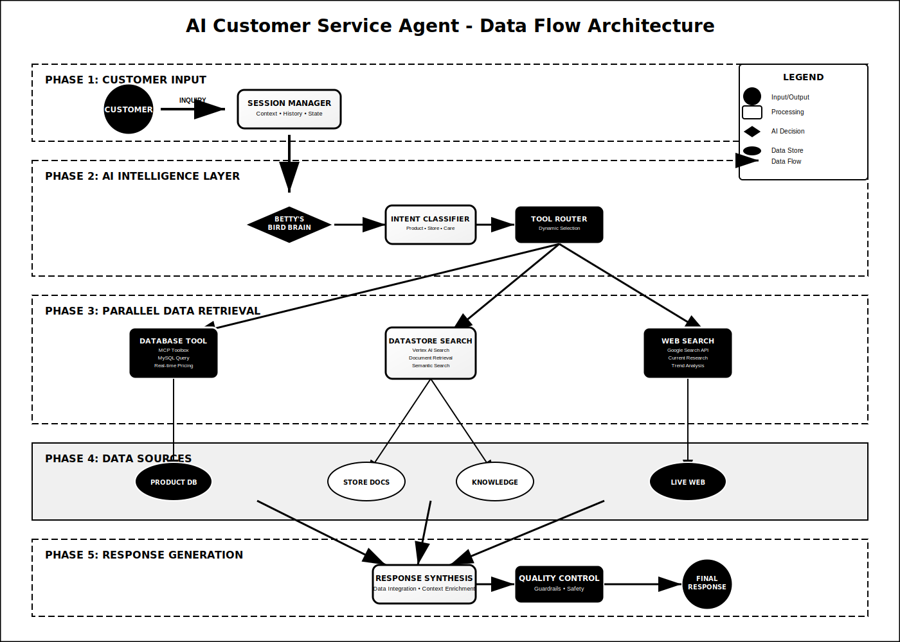

# AI Customer Service Agent - Architecture Diagrams

This document provides a comprehensive overview of all architectural diagrams for the AI Customer Service Agent project, designed specifically for Betty's Bird Boutique.

## Overview

The architecture diagrams illustrate the complete system design from customer interfaces through intelligent processing to data sources and infrastructure. Each diagram serves a specific purpose in understanding different aspects of the AI agent's operation.

---

## Diagram Inventory

### 1. Overall System Architecture
**File:** `01-system-architecture.svg`
**Purpose:** High-level view of the complete system stack
**Audience:** Executive stakeholders, solution architects, technical leads

**Key Components Illustrated:**
- Customer Interface Layer (Web, Mobile, Chat Widget, API)
- Google Agent Development Kit (ADK) Layer
- Data Sources & Integration Layer
- Infrastructure & Security Layer

**Use Cases:**
- Executive presentations
- System overview documentation
- Technical architecture reviews
- Stakeholder alignment meetings

---

### 2. Data Flow Architecture
**File:** `02-data-flow.svg`
**Purpose:** Detailed flow of customer requests through the system
**Audience:** Software architects, developers, data engineers

**Key Processes Illustrated:**
- Customer input processing and session management
- Betty's Bird Brain agent intelligence layer
- Parallel tool execution (Database, Datastore, Web Search)
- Data aggregation and response synthesis
- Quality control and guardrail enforcement

**Use Cases:**
- Development planning
- Performance optimization
- Troubleshooting and debugging
- Integration design

---

### 3. Component Architecture
**File:** `03-component-architecture.svg`
**Purpose:** Internal structure and component relationships
**Audience:** Development teams, system integrators

**Key Elements Illustrated:**
- Agent Framework (Session Service, Core Agent, Tool Orchestration)
- Tools Layer (Database Tools, Knowledge Base, Search Tools)
- Data Access Layer (Product DB, Document Store, External APIs)
- Storage & Infrastructure (Cloud Platform, Security, Monitoring)

**Use Cases:**
- Development implementation
- Component integration planning
- Technical documentation
- Code architecture reviews

---

### 4. Agent Decision Flow
**File:** `04-agent-decision-flow.svg`
**Purpose:** Intelligence and decision-making process flow
**Audience:** AI specialists, business analysts, quality assurance

**Key Logic Illustrated:**
- Customer input processing and validation
- Business guardrails and safety checks
- Intent classification (Product, Store, Bird Care)
- Dynamic tool selection and execution
- Response generation and quality validation

**Use Cases:**
- AI model training and refinement
- Business rule configuration
- Quality assurance testing
- Conversation flow optimization

---

### 5. Integration Architecture
**File:** `05-integration-architecture.svg`
**Purpose:** External system connections and integrations
**Audience:** Integration specialists, DevOps engineers, security teams

**Key Integrations Illustrated:**
- External Systems (Website, Mobile Apps, CRM, Social Media)
- API Gateway & Integration Layer
- Core AI Agent Processing
- Data Integration & Storage
- Security, Monitoring & Compliance

**Use Cases:**
- Integration planning and implementation
- Security architecture review
- Compliance and audit documentation
- Third-party system onboarding

---

## Diagram Usage Guidelines

### For Technical Teams
- **Development:** Focus on Component Architecture (#3) and Data Flow (#2)
- **Integration:** Prioritize Integration Architecture (#5) and System Architecture (#1)
- **Testing:** Use Agent Decision Flow (#4) and Data Flow (#2)

### For Business Stakeholders
- **Executive Reviews:** System Architecture (#1) provides high-level overview
- **Business Process:** Agent Decision Flow (#4) shows customer experience
- **ROI Planning:** Integration Architecture (#5) demonstrates business value

### For Customer Documentation
- **Customer Presentations:** System Architecture (#1) and Data Flow (#2)
- **Training Materials:** Agent Decision Flow (#4) for understanding AI capabilities
- **Technical Specs:** Component Architecture (#3) for technical customers

---

## Diagram Maintenance

### Update Frequency
- **System Architecture:** Updated with major system changes
- **Data Flow:** Updated with process or tool changes
- **Component Architecture:** Updated with code architecture changes
- **Agent Decision Flow:** Updated with AI model or business rule changes
- **Integration Architecture:** Updated with new integrations or security changes

### Version Control
All diagrams are maintained in SVG format for:
- **Scalability:** Vector graphics scale without quality loss
- **Version Control:** Text-based format works well with Git
- **Accessibility:** Can be viewed in any modern web browser
- **Professional Output:** High-quality rendering for presentations

### Diagram Standards
- **Color Scheme:** Consistent across all diagrams
- **Typography:** Arial/sans-serif fonts for readability
- **Layout:** Logical flow from top to bottom, left to right
- **Labeling:** Clear, concise component and process names
- **Legends:** Included where necessary for clarity

---

## Related Documentation

### Architecture Documents
- [README.md](../README.md) - Complete project documentation
- [Technical Implementation](../src/) - Source code and configuration

### Business Documents
- [Store Information](../src/docs/) - Betty's Bird Boutique business details
- [Setup Guides](../src/docs/QUICK_START.md) - Implementation instructions

### Development Resources
- [Scripts](../src/scripts/) - Deployment and management scripts
- [Configuration](../src/tools.yaml) - System configuration files

---

## Contact Information

For questions about these diagrams or requests for additional architectural documentation:

**Technical Architecture:** Development Team Lead
**Business Architecture:** Solution Architect
**Diagram Updates:** Project Repository Maintainers

**Project Repository:** [https://github.com/Imsharad/ai-customer-service-agent-google-adk](https://github.com/Imsharad/ai-customer-service-agent-google-adk)