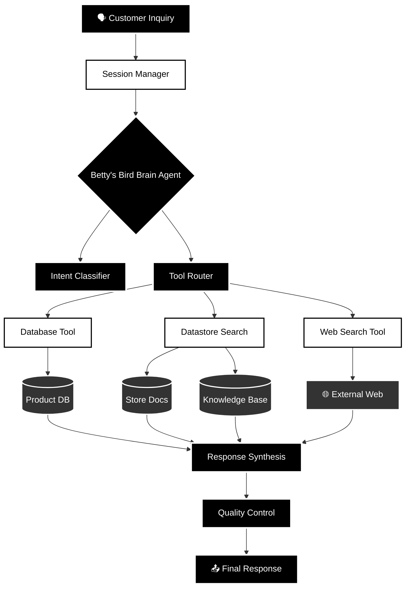

# AI Customer Service Agent - Data Flow Architecture (Mermaid)

## Process Flow Description

### Phase 1: Input Processing
- **Customer Inquiry** → Initial customer request enters the system
- **Session Manager** → Maintains conversation context and history

### Phase 2: Intelligence Layer
- **Betty's Bird Brain Agent** → Core AI processing using Gemini 2.5 Flash
- **Intent Classifier** → Determines customer intent (product query, store info, bird care)
- **Tool Router** → Selects appropriate tools for parallel execution

### Phase 3: Data Retrieval
- **Database Tool** → Real-time product pricing and inventory
- **Datastore Search** → Store information and business policies
- **Web Search Tool** → Current bird care research and trends

### Phase 4: Information Synthesis
- **Response Synthesis** → Combines data from all sources
- **Quality Control** → Guardrails and business protection
- **Final Response** → Natural language response to customer