# AI Customer Service Agent - Data Flow Architecture (Mermaid)

```mermaid
graph TD
    %% Customer Input
    A[🗣️ Customer Inquiry] --> B[Session Manager]

    %% Core Processing
    B --> C{Betty's Bird Brain Agent}
    C --> D[Intent Classifier]
    C --> E[Tool Router]

    %% Tool Selection & Parallel Execution
    E --> F[Database Tool]
    E --> G[Datastore Search]
    E --> H[Web Search Tool]

    %% Data Sources
    F --> I[(Product DB)]
    G --> J[(Store Docs)]
    G --> K[(Knowledge Base)]
    H --> L[🌐 External Web]

    %% Data Aggregation
    I --> M[Response Synthesis]
    J --> M
    K --> M
    L --> M

    %% Quality Control
    M --> N[Quality Control]
    N --> O[📤 Final Response]

    %% Styling for high contrast
    classDef primary fill:#000,stroke:#fff,stroke-width:3px,color:#fff
    classDef secondary fill:#fff,stroke:#000,stroke-width:2px,color:#000
    classDef database fill:#333,stroke:#fff,stroke-width:2px,color:#fff
    classDef external fill:#666,stroke:#fff,stroke-width:2px,color:#fff
    classDef output fill:#000,stroke:#fff,stroke-width:3px,color:#fff

    class A,O output
    class C,D,E,M,N primary
    class B,F,G,H secondary
    class I,J,K,L database
```

## Process Flow Description

### Phase 1: Input Processing
- **Customer Inquiry** → Initial customer request enters the system
- **Session Manager** → Maintains conversation context and history

### Phase 2: Intelligence Layer
- **Betty's Bird Brain Agent** → Core AI processing using Gemini 2.5 Flash
- **Intent Classifier** → Determines customer intent (product query, store info, bird care)
- **Tool Router** → Selects appropriate tools for parallel execution

### Phase 3: Data Retrieval
- **Database Tool** → Real-time product pricing and inventory
- **Datastore Search** → Store information and business policies
- **Web Search Tool** → Current bird care research and trends

### Phase 4: Information Synthesis
- **Response Synthesis** → Combines data from all sources
- **Quality Control** → Guardrails and business protection
- **Final Response** → Natural language response to customer